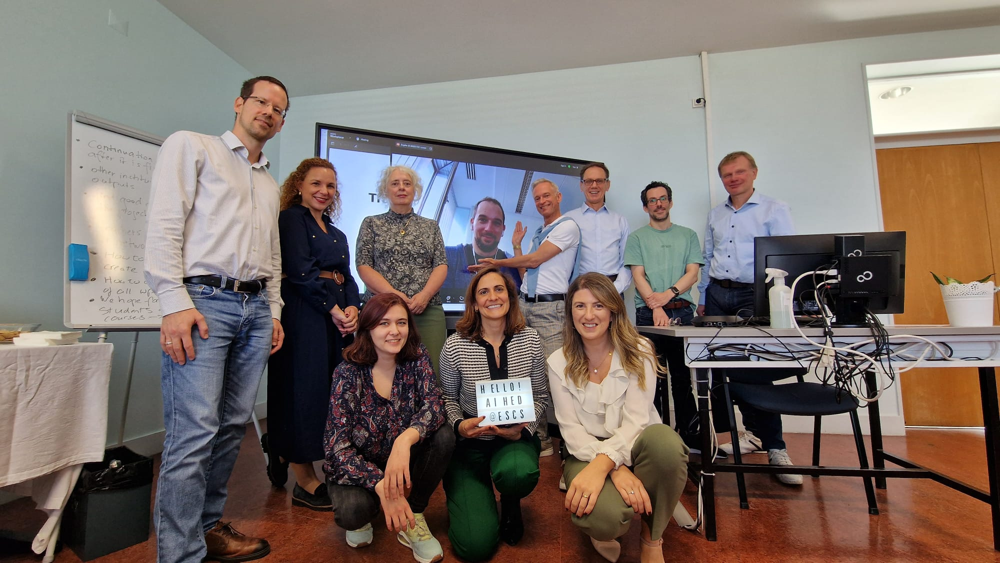

---
authors:
date: 2024-11-29T19:06:46Z
description: ""
draft: false
resources: 
- src: images/ai-hed-team.jpeg
  name: "header"
slug:
subtitle:  Artificial Intelligence in Higher Education Teaching and Learning
tags: 
  - ai
categories: 
  - updates
title: "AI-HED Kick-off Meeting took place in Lisbon in November 2024"
options:
  navbar: navbar navbar-expand-lg bg-white fixed-top font-weight-bold
  unlisted: false
  showHeader: true
  hideFooter: false
  hideSubscribeForm: false
  header:
scripts:
  -
---

On 7 and 8 November 2024, the kick-off meeting for the AI-HED Project took place at the School of Communication and Media of the Polytechnic University of Lisbon (ESCS-IPL).

After many months of working together to prepare the proposal and with the project already in its beginning stages, with various activities already underway and after several online meetings, the team met in person to officially start the project.

The two-day meeting brought together representatives of the four partner organisations. From the **School of Communication and Media Studies - Polytechnic University of Lisbon (ESCS-IPL)**, Ana Raposo, Tatiana Nunes, and Bruno Amaral Tiago attended; representing the **Amsterdam University of Applied Sciences (AUAS)** were Erik Kostelijk, Bernard Smeenk, and Margit Varga; the **Fachhochschule BFI Wien (UAS-BFI)** was represented by Dietmar Paier, Johannes Wetzinger, and Anastasija Lyubova; and from the **University of Zagreb, Faculty of Organization and Information**, Izabela Oletic participated, with Bogdan Okreša Đurić joining online.

Each of the partners gave an update on the status of the activities relating to the Working Package for which they are responsible, additional tasks were defined and details were given of each institution's contribution to each part of the project.

In addition to this progress report, the meeting was also marked by the presentation of two important documents for the project: the ‘Inclusion and Diversity Agenda’ by the Amsterdam team and the ‘Communication Plan’ by the Lisbon team.

**About the AI-HED - Artificial Intelligence in Higher Education Teaching and Learning**

The AI-HED Project, co-funded by the European Commission, aims to adapt the teaching and learning environments at our Higher Education Institutions (HEIs) to the shifts caused by Artificial Intelligence (AI). With this project, the consortium will explore, test and conceptualise the impact of AI on teaching and learning, enhance teachers’ skills, competencies and attitudes to use AI in teaching and learning, enhance students skills, competencies and attitudes to use AI in learning and also develop recommendations for HEIs on integration of AI in teaching and learning.

The Amsterdam University of Applied Sciences (AUAS) was the applicant organisation, in partnership with the University of Applied Sciences BFI Vienna (UAS-BFI), the Polytechnic University of Lisbon (IPL) and the University of Zagreb (UNIZG).

The project “Artificial Intelligence in Higher Education Teaching and Learning” (AI-HED) - 2024-1-NL01-KA220-HED-000248874, launched with co-funding from the European Commission under the Erasmus+ Programme in the fields of education, training, youth, and sport for the 2021-2027 period, was submitted and awarded under Key Action 2: Cooperation among organisations and institutions.

**Erasmus+ Funding for the project AI-HED - Artificial Intelligence in Higher Education Teaching and Learning**

**Four Higher Education Institutions submitted the application of the project “Artificial Intelligence in Higher Education Teaching and Learning” (AI-HED), that has been awarded with 250.000 euros and received 89 points out of 100 by the European Commission.**

The [*Amsterdam University of Applied Sciences*](https://www.amsterdamuas.com/) (AUAS) was the applicant organisation, in partnership with the [*University of Applied Sciences BFI Vienna*](https://www.fh-vie.ac.at/en/) (UAS-BFI), the [*Polytechnic University of Lisbon (IPL)*](https://www.ipl.pt/en) and the [*University of Zagreb*](https://www.unizg.hr/homepage/) (UNIZG).

The broader aim of AI-HED Project is to adjust the teaching and learning environments at HEIs (Higher Education Institutions) to the shifts caused by Artificial Intelligence (AI). With this project, the consortium wants to explore, test and conceptualise the impact of AI on teaching and learning, enhance teachers skills, competences and attitudes to use AI in teaching and learning, enhance students skills, competences and attitudes to use AI in learning and also develop recommendations for HEIs on integration of AI in teaching and learning.

The AI-HED project brings together members from the four partner institutions. Representing the **School of Communication and Media Studies - Polytechnic University of Lisbon (ESCS-IPL)** are Ana Raposo, Tatiana Nunes, and Bruno Amaral Tiago; from the **Amsterdam University of Applied Sciences (AUAS)**, Erik Kostelijk, Bernard Smeenk, and Margit Varga; from the **Fachhochschule BFI Wien (UAS-BFI)**, Dietmar Paier, Johannes Wetzinger, and Anastasija Lyubova; and from the **University of Zagreb, Faculty of Organization and Information**, Izabela Oletic and Bogdan Okreša Đurić.

AI-HED is a two years project, ending in the end of the academic year 2025/2026, and will develop a variety of activities, such as:

- A set of measures to enhance the AI literacy of lecturers (AI starter kit, training and Massive Open Online Course - MOOC)

- Design, implementation and evaluation of 16 pilot courses which integrate AI in teaching and learning from different disciplines

- Development of concluding recommendations on how to integrate AI in teaching and learning

- A set of outreach activities to share the results with relevant stakeholders

AI-HED focuses on a key topic of the on-going digital transformation - Artificial Intelligence (AI). AI is spreading at an unprecedented pace and has a profound impact on higher education, as exemplified by the emergence of ChatGPT and similar tools. AI-HED explores ways to adjust the teaching and learning environments at higher education institutions (HEIs) to the shifts caused by AI. More specifically, the project aims to test and conceptualise the impact of AI on the teaching and learning

process, to enhance the skills and competences of teachers and students to use AI in teaching and learning environments, and to develop recommendations for HEIs on integration of AI in the teaching and learning process in a responsible, critical and inclusive way

Erasmus+ is the EU Programme in the fields of education, training, youth and sport for the 2021-2027 period, and AI-HED Project was submitted and awarded under the Key Action 2: Cooperation among organisations and institutions.
