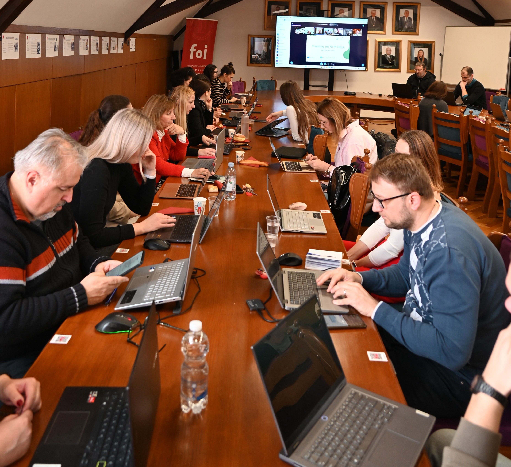
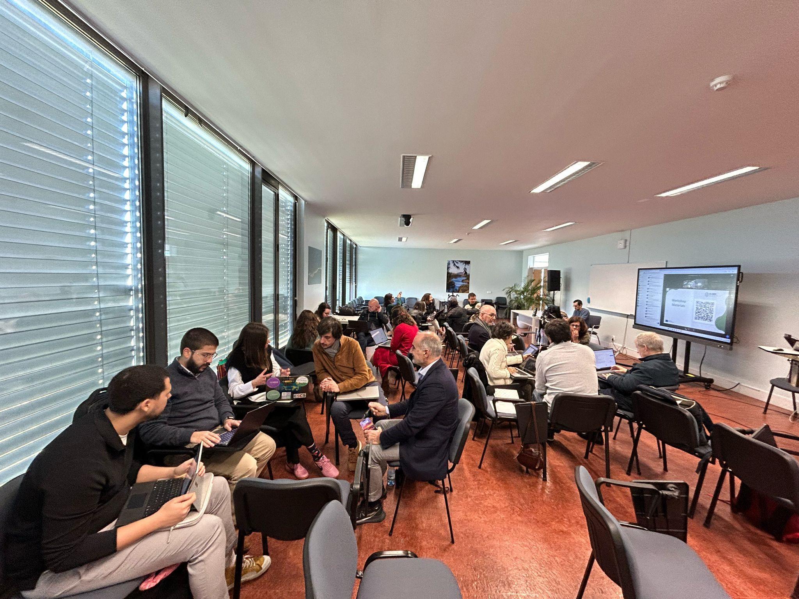
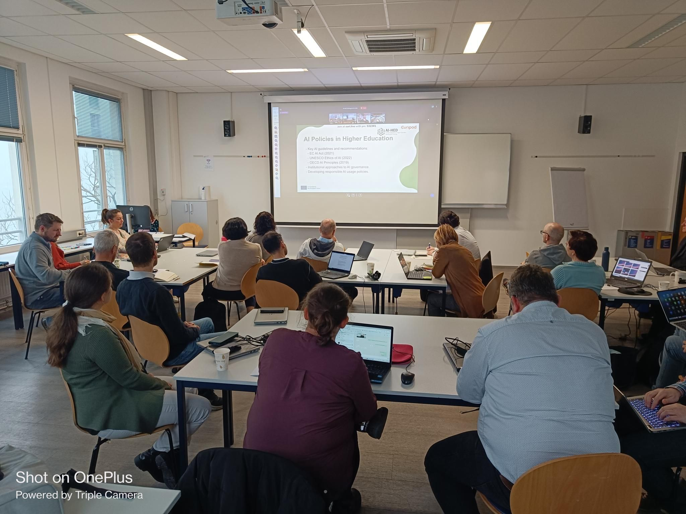
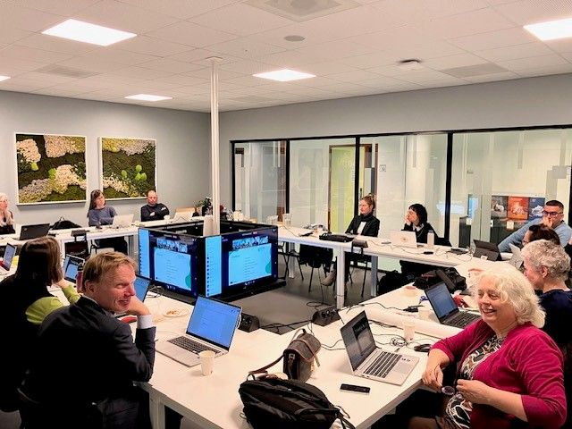

A two-day workshop on artificial intelligence (AI) tools in the context of higher education, held on February 26 and March 5, 2025, brought together more than 100 educators from four partner institutions in the Netherlands, Austria, Croatia, and Portugal.

Our colleagues from the University of Zagreb, Faculty of Organization and Informatics, took the brave lead on making this workshop happen.

On the first day of the workshop, two lectures were held:

- **Introduction to Artificial Intelligence** – **Full Prof. Markus Schatten** from the Faculty of Organization and Informatics presented the basic concepts of artificial intelligence and an overview of the latest trends in AI development. Participants were introduced to AI applications, particularly in educational contexts.
- **Artificial Intelligence in Learning and Teaching Processes** – **Assist. Prof. Bogdan Okreša Đurić** from the Faculty of Organization and Informatics discussed the role of AI tools in higher education, presenting relevant case studies and concrete examples of AI usage at partner institutions. Participants discussed the pedagogical impact of AI tools and various teaching methods and approaches in the digital age.

In addition to these two lectures, the first day also featured a practical workshop where participants, guided by local mentors, tested selected AI tools. During this session, teams formed, expectations were clarified, and participants had the chance to experiment with AI technologies in an educational setting.

On the second day, a third lecture was held:

- **Ethics, Philosophy, and Regulations of Artificial Intelligence** – **Sander van der Waal**, director of **Waag Future Lab** from the Netherlands, gave a lecture on the ethical, philosophical and legal aspects of artificial intelligence. Participants examined fundamental ethical and legal challenges surrounding AI tools.

The workshop concluded with team project presentations, in which participants showcased their ideas and applications of AI tools in education.

The AI-HED workshop was conducted in a **hybrid format** (with online education while participants from different institutions gathered on-site). These sessions enabled educators to gain new knowledge and insights into the possibilities of AI tools in modern education, as well as to network and share experiences.

### Workshop Objectives
- Introduce fundamental AI concepts and tools relevant to education.
- Explore real-world applications of AI in teaching and learning.
- Address ethical considerations and best practices for AI use in classrooms.
- Provide hands-on experience through interactive, gamified sessions.
- Foster international collaboration among lecturers across partner universities.

### Participating Universities
This workshop is a collaborative effort between:
- Amsterdam University of Applied Sciences (AUAS) 🇳🇱  
- University of Applied Sciences BFI Vienna (UAS-BFI) 🇦🇹  
- Polytechnic University of Lisbon (IPL) 🇵🇹  
- University of Zagreb (UNIZG) 🇭🇷  

### Workshop Agenda
#### Day 1: Understanding AI in Education (26 Feb 2025)
- **Session 1:** Introduction to AI & Key Concepts (Prof. [Bogdan Okreša Đurić](/team/bogdan-okresa-duric/))
- **Session 2:** AI-Based Tools & Pedagogical Impact (Prof. Markus Schatten)
- **Session 3:** Ethical & Legal Considerations of AI in Education (TBA)
- **Interactive Workshop:** Hands-on with AI tools in teaching & learning

#### Day 2: Practical Implementation & Collaborative Learning (5 Mar 2025)
- **Team Projects:** Applying AI tools to real-world teaching scenarios
- **Attendee Presentations:** Sharing insights & lessons learned
- **Discussion & Closing Remarks:** AI’s future in education

## Learnings and Recommendations

We encourage a culture of learning and sharing. Below you will find the presentations on AI for higher-education, and we encourage you to consider adopting a similar hybrid format for your own teams.

Still, a few challenges emerged. Extended online sessions occasionally tested participants’ concentration, and sporadic sound-quality issues hindered communication. Meanwhile, although live polls were beneficial, some open-ended questions sometimes slowed the flow of conversation. In addition, group presentations across countries, while insightful, could become lengthy, underscoring a need for a more concise format of about three to five minutes per presentation to sustain a more energetic pace.

By addressing these considerations, future workshops can further enhance participant engagement. For example, encouraging each country’s participants to align project details locally before sharing them with the wider group can make presentations more efficient. Concluding the workshop with an expert-led debrief can also prompt broader reflections and final discussions. In these ways, future initiatives can maintain momentum, deepen collaboration, and strengthen the community of educators embracing AI in higher education.

## Training Materials

[AI-based Tools](./downloads/AI-HED_Starter_Kit__AI-based_Tools.pdf)

[Case_Studies](./downloads/AI-HED_Starter_Kit__Case_Studies.pdf)

[Current Practices](./downloads/AI-HED_Starter_Kit__Current_Practices.pdf)

[Training Overview](./downloads/AI-HED_Training__Training_Overview.pdf)

[Workshop Materials](./downloads/AI-HED_Training__Workshop_Materials.pdf)
