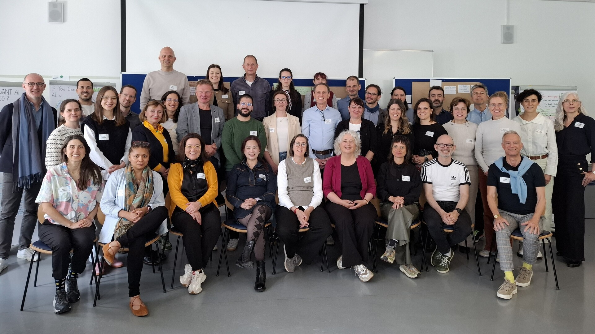
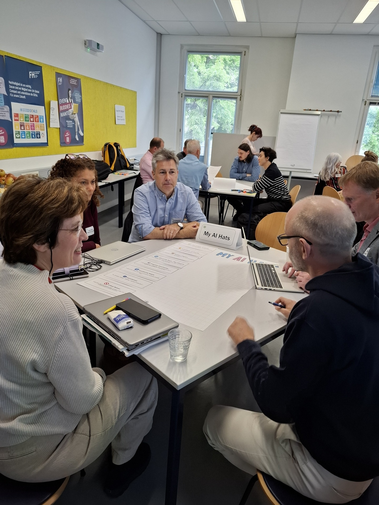
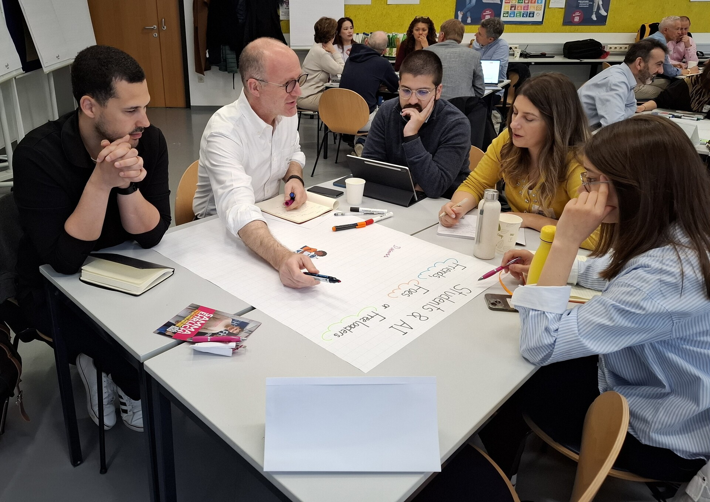
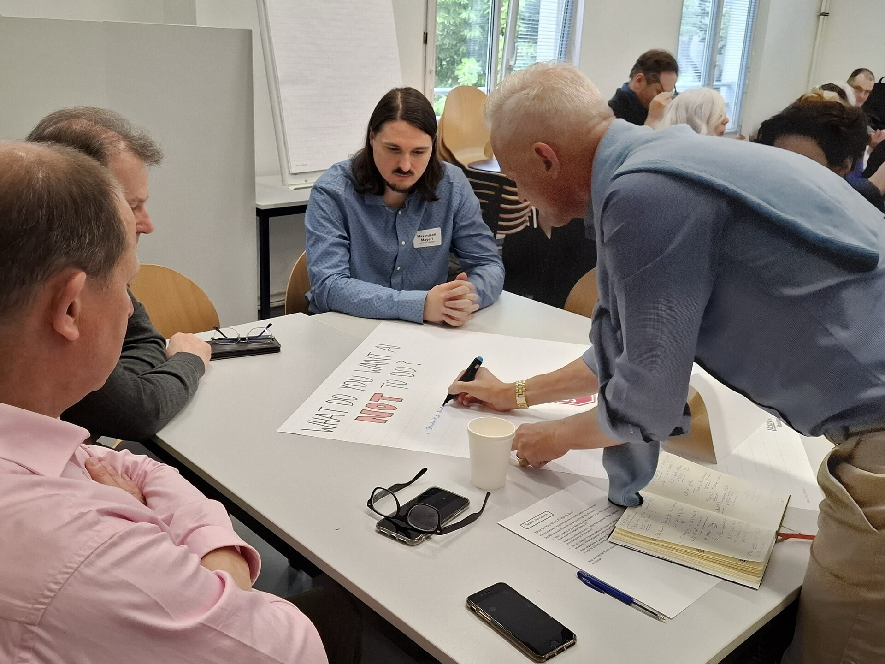
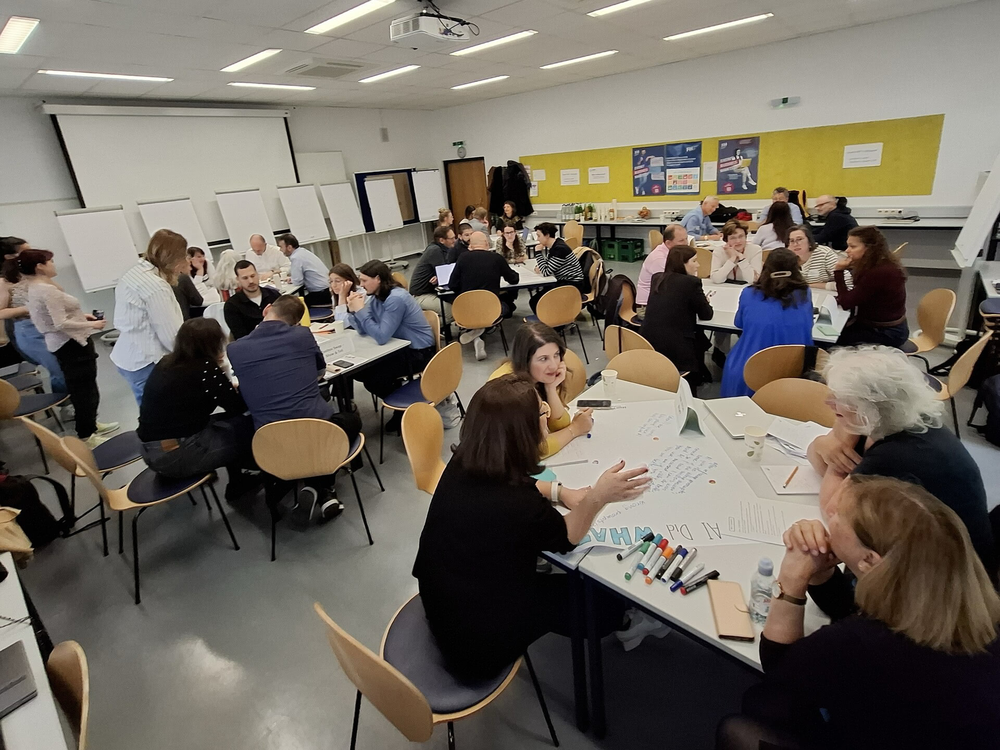

---
authors:
  - johannes
date: 2025-05-20T21:02:01+01:00
description: ""
draft: false
resources: 
- src: images/20250508_090750.jpg
  name: "header"
- src:
  name: slide-1
slug:
subtitle: 
tags: 
  - 
categories: 
  - 
title: "Workshop on Preparation of Pilot Courses successfully held in Vienna"
layout: single
options:
  unlisted: false
  showHeader: true
  hideFooter: false
  hideSubscribeForm: true
  header:
  navbar: navbar navbar-expand-lg bg-white fixed-top font-weight-bold
scripts:
  -
---

On May 8th and 9th, 2025, the University of Applied Sciences BFI Vienna successfully organized a workshop on the “Development of Pilot Courses”. This two-day event in Vienna was part of the EU-funded project „Artificial Intelligence in Higher Education Teaching and Learning“ (AI-HED) and focused on developing syllabi for innovative pilot courses that integrate Artificial Intelligence (AI) into the teaching and learning process.

In total, 24 syllabi for pilot courses from various disciplines were prepared during the workshop. 39 lecturers and AI-HED team members from the University of Applied Sciences BFI Vienna, the Amsterdam University of Applied Sciences, the Polytechnic University of Lisbon (School of Communication and Media Studies), and the University of Zagreb (Faculty of Organization and Informatics) participated in the international event.

The workshop covered key topics to consider when integrating AI into pilot courses, including syllabus development, learning outcomes, and teaching and assessment methods. Prior to the workshop, the participants received detailed guidelines on “[Adopting AI in teaching](https://ai-hed.eu/downloads/AI-HED_WP3_Guidelines_course_development_final_Feb14_2025.pdf)” which were developed by the University of Applied Sciences BFI Vienna during the AI-HED project. The participants were enthusiastic about developing innovative pilot courses which resulted in fruitful peer-to-peer exchanges and a productive working atmosphere.

The workshop was part of Work Package 3 of the AI-HED project on the “Selection and design of Pilot Courses using AI in the teaching and learning” which is coordinated by the University of Applied Sciences BFI Vienna. The workshop was organized by Dietmar Paier and the team of the Teaching and Learning Center (Anastasija Lyubova, Barbara Maly-Bowie, Flora Ingegneri) together with Johannes Wetzinger, the coordinator of EU projects at the University of Applied Sciences BFI Vienna.

The developed pilot courses will be implemented in the autumn term 2025 by the respective partner institutions in Work Package 4 on the “Implementation of the Pilot Courses using AI in the teaching and learning process” (coordinated by the Amsterdam University of Applied Sciences). An in-depth evaluation will accompany the implementation to develop recommendations for using AI in the teaching and learning process. Related resources (best practices, recommendations) will be published on the AI-HED project website as soon as they are available. Stay tuned!

  

    

      

        <h4 class="mb-0">Workshop Program</h4>
        
Download the full program of the Vienna workshop on syllabus development

      

      

        <a href="AI-HED_Vienna_workshop_syllabus_development_final_program_23.04.2025.pdf" class="btn btn-primary btn-lg">
          <i class="fas fa-file-pdf mr-2"></i>Download Program
        </a>
      

    

  

  <h3 class="mb-4">Workshop</h3>
  

    

      

        
        

          

          

        

      

    

    

      

        
        

          

          

        

      

    

    

      

        
        

          

          

        

      

    

    

      

        
        

          

          

        

      

    

    

      

    

  

