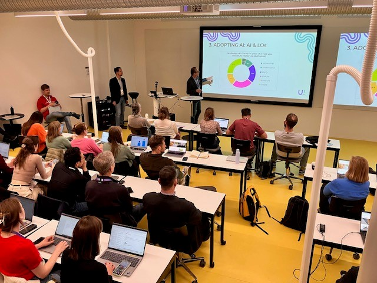

On 22 May, Dietmar Paier and Johannes Wetzinger from the University of Applied Sciences BFI Vienna presented the Erasmus+ project "Artificial Intelligence in Higher Education Teaching and Learning" (AI-HED) at the "U!REKA Connects 2025" event in Helsinki. "U!REKA Connects" is the annual flagship event of the "Urban Research and Education Knowledge Alliance" ([U!REKA](https://ureka.eu/)). U!REKA is a European University Alliance comprising 30 institutions from across Europe, including higher education institutions, cities, regional and district councils, and European networks. This year, the event took place at the Metropolia University of Applied Sciences in Helsinki, Finland, on 21 and 22 May. More than 400 representatives from the U!REKA network participated in the gathering.

The AI-HED team members Dietmar Paier and Johannes Wetzinger introduced the AI-HED project and presented initial results. Further information about the available results can be found in the [AI-HED resources](https://ai-hed.eu/resources/). Didactical considerations for the adoption of artificial intelligence (AI) in teaching and learning were also discussed. The AI-HED team members concluded their presentation by providing an overview of upcoming events and activities. This presentation was part of a session entitled "AI and smart solutions in higher education". The AI-HED team members Bernard Smeenk and Erik Kostelijk from the Amsterdam University of Applied Sciences also participated in the session.

The following AI-HED partner institutions are participating in the U!REKA European University Alliance: 

- Amsterdam University of Applied Sciences (full partner in U!REKA)
- Polytechnic University of Lisbon (full partner in U!REKA)
- University of Applied Sciences BFI Vienna (associated partner in U!REKA)
- University of Zagreb – Faculty of Organization and Informatics (FOI).
