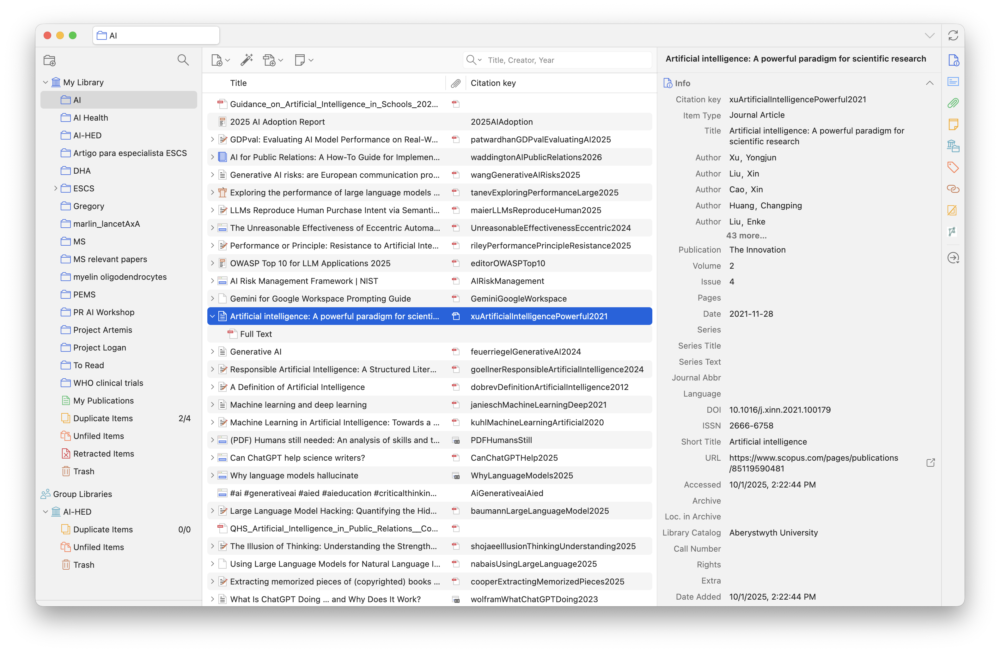
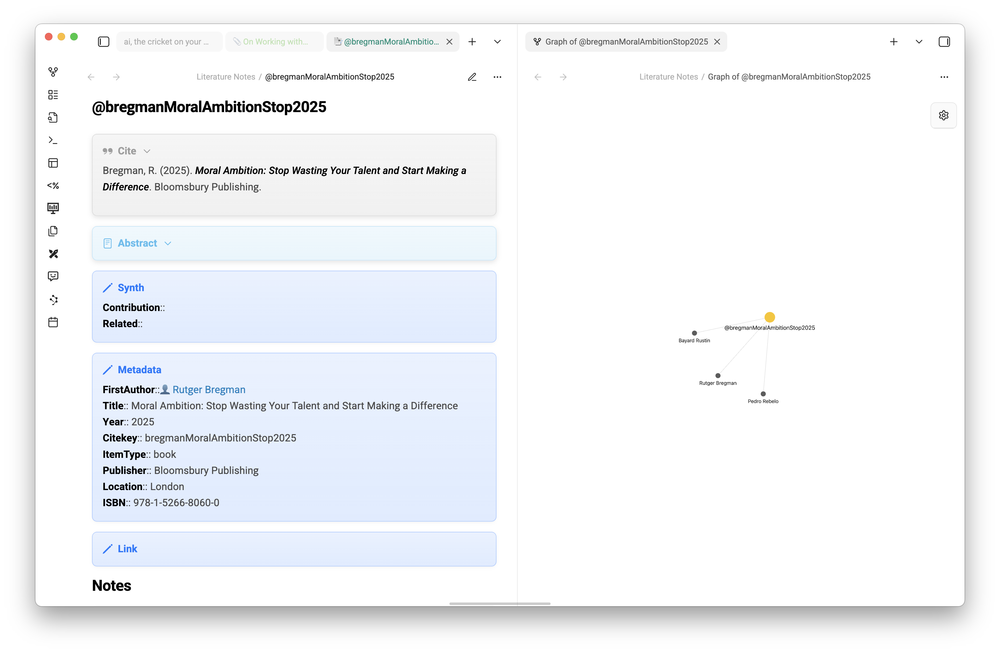
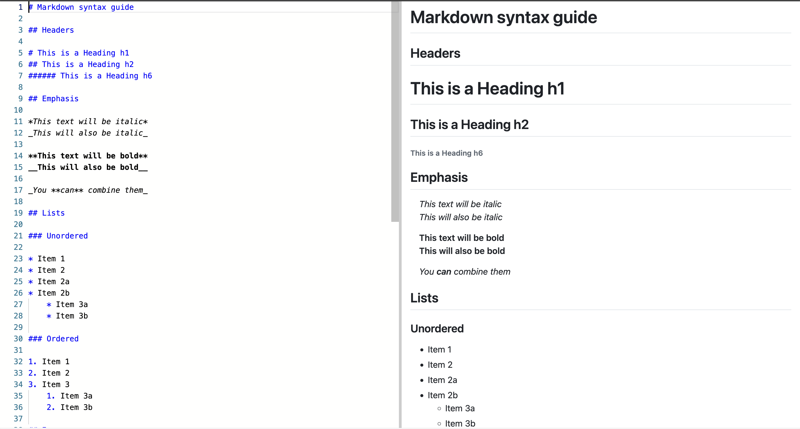
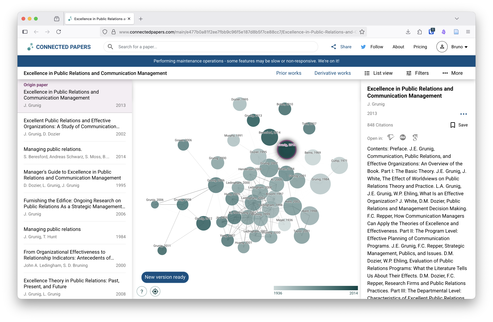
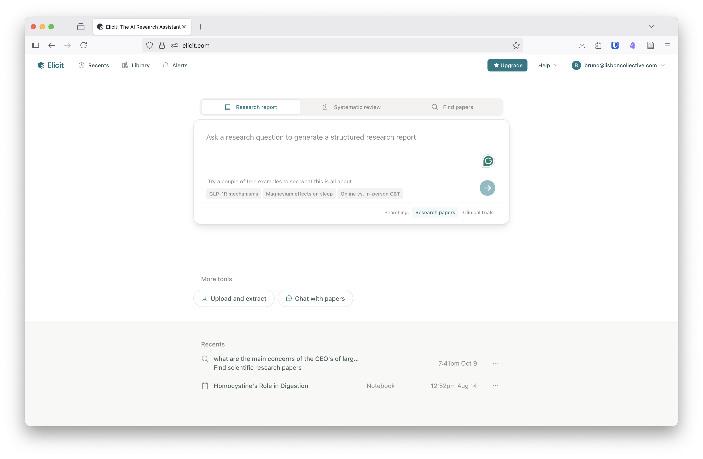
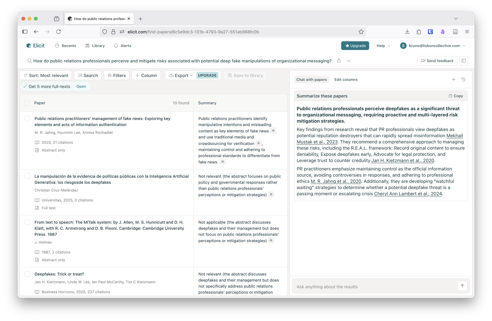
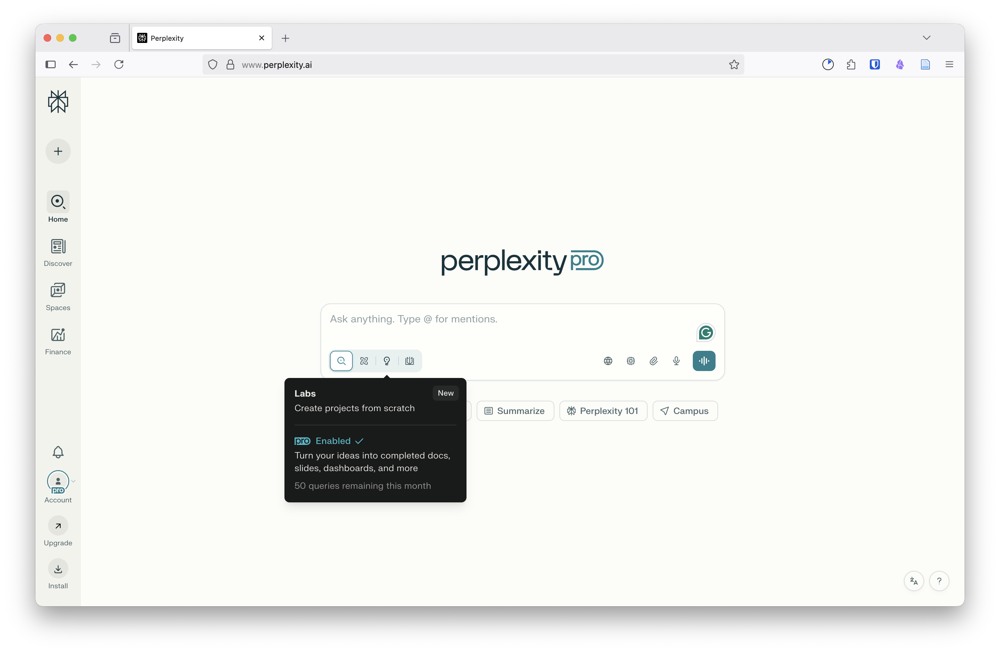
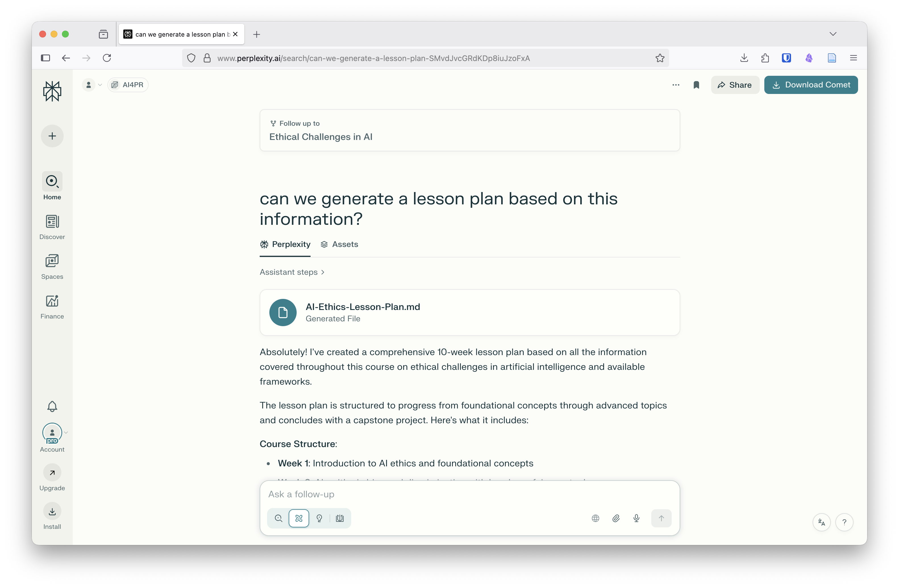
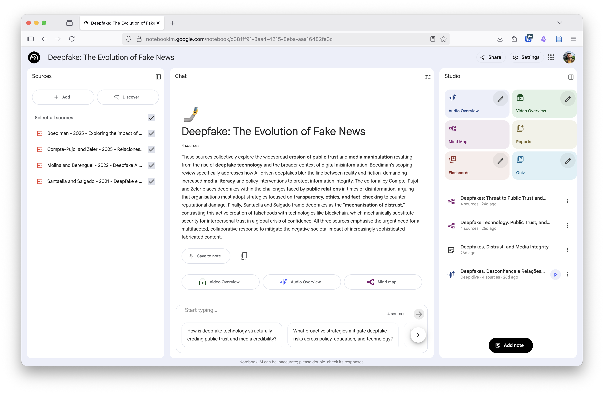

Most of us were not taught how to use the computer to its full potential. We do not know that there is a fundamental difference between `variable1 = 12` and `variable2 = "12"` because we grew up with full-featured apps like MS Word and Excel. In contrast, IT students feel empowered by their grasp of code and their understanding that variable1 is an integer number while variable2 is a string of characters that can't be used in any mathematical operation.

This is a trivial example, but these little things add up to form a chasm between the Wizards of STEM and us, the Muggles of Humanities. Fortunately, this new age of Artificial Intelligence (AI) is going to change that, right?

I believe AI is going to make this chasm worse and harder to cross. And Ethan Mollick explains this well, "[We're moving from partners to audience, from collaboration to conjuring.](https://www.oneusefulthing.org/p/on-working-with-wizards)". The problem with being an audience is that we lose agency. The problem with conjuring is that we never know what to expect, and the result can be catastrophic.

But there is a way out that doesn't require us to learn how to code, but does require that we rethink the way we use our computers. Because computers won't be going away, only the way that we interact with them will change. Maybe it will be through chat or voice, or with gestures and augmented reality interfaces. It doesn't matter as long as we have a method that allows us to work in a more focused way while at the same time leaving us time to be creative and enough cognitive energy to spark innovation.

What comes next is my way of working, explained in a way that I hope will be useful for you to build your own method and find your best toolset. Maybe you use other tools or better methods. If that's the case, take a read and share your workflow with us. After all, the web was made for us to learn as a community.

For context, I come from a Humanities training but was lucky to have parents who supported my love for technology since I was 9, Internet access since I was 12, and friends who taught me how to code and told me which books to read. I built my first website long before blogs came to change the Web forever.

What follows will require a lot of groundwork before we even begin to talk about how AI can serve us. At the end, I hope you will come out with new ideas on how to use your devices and any AI tool that comes along.

## Let's break the illusion
AI is not going to do everything on its own, at least not in such a way that it will take away all our jobs. Even mechanistic tasks that right now are done by humans require a great deal of thought on the operating procedures.

- Where does the system get information?
- How is that information processed and validated?

We should think of AI as our assistant who is ready to take on the boring tasks. And this assistant doesn't live inside our heads with access to our academic knowledge, our preferred way of doing things, our the tools that we use. (Although this last part is changing.)

Making our assistant useful requires more than just pressing magic buttons or pasting a prompt we found on LinkedIn. We are going to break it down into 3 steps.

1.  Collecting and Organising
2.  Searching
3.  Putting AI to Use

## Collecting and Organising

We find nuggets everywhere. Academic papers, news articles, book chapters, webpages, and lectures. These can all be useful to provide context to an LLM like ChatGPT or Claude.

I use [Zotero](https://zotero.org/) to capture everything from webpages to academic papers. Others use [Mendeley](https://www.mendeley.com/), which is an equally good choice. I simply prefer Zotero for being open-source and connecting with tools I already use. There are browser plugins that allow you to capture any kind of academic source or webpage snapshots. These plugins even download the PDF for you, and Zotero allows you to add notes and highlights to each item.

Everything you add to Zotero can be exported or dragged onto your AI tool to provide context and avoid **hallucinations**. The export version will also include your notes so that the LLM can include your takeaways in the output.


My way of organising items in Zotero is plain; I only use folders for projects I am working on and then export the bibliographic references automatically.

### Note Taking and Markdown
I use Zotero's PDF reader to take notes and make highlights on any academic content. Once I am done reading, I move those notes to [Obsidian](https://obsidian.md/) with the [Zotero Integration Plugin](https://github.com/mgmeyers/obsidian-zotero-integration) that generates a full literature note that I can review and link to related notes.



There are tons of other note-taking apps that you can use instead of Obsidian,
like [One Note](https://www.onenote.com/), [Google Keep](https://keep.google.com/), [LogSeq](https://logseq.com/), [Joplin](https://joplinapp.org/), and several others.

Whichever you choose, it is a good idea to use [Markdown](https://www.markdownguide.org/) to write your notes, as it is a plain text format that is easy for us to learn and for AI systems to understand.

<figure>

<figcaption aria-hidden="true">example of the markdown syntax</figcaption>
</figure>

Why does this work for better prompts? Because [developers have been writing their documentation using Markdown since 2002](https://en.wikipedia.org/wiki/Markdown#History), and that gave LLMs plenty of training data. Markdown is also very structured, and this provides a better context for AI tools.

In my current setup, I use Obsidian synced with Zotero in a simplified version of [Alexandra Phelan's Workflow](https://medium.com/@alexandraphelan/an-updated-academic-workflow-zotero-obsidian-cffef080addd). And I have created a [starter kit for Obsidian that you can find on my blog](https://brunoamaral.eu/an-obsidian-kick-start-for-students/).
\# Searching
This is where new AI tools are shining.

Academic journals and libraries are still our best sources of knowledge, but suffer from an overabundance of material that makes it harder to find what is relevant. Fortunately, there is now a myriad of new tools to help us.

In no particular order, here are a few that are worth exploring.

<h3><a href="https://www.connectedpapers.com/" target="_blank">Connected Papers <i class="fas fa-external-link-alt"></i></a></h3>

This tool doesn't use AI. It allows you to search a topic or a specific paper and explore how different papers are linked through their citations.

You can use it to explore a network graph of research, to make sure your research didn't skip any important papers, and to create a bibliography for your thesis. You can also export the results to Zotero for future reference.



<h3><a href="https://elicit.com/" target="_blank">Elicit <i class="fas fa-external-link-alt"></i></a></h3>

One way to avoid AI hallucinations is to ground the tool to existing documents; that's what this tool does. Using Elicit, we can find papers from their database or upload our own set of files to conduct a systematic review of the literature.

The tool uses AI to read the full text and allows you to have a conversation with your own collected papers. We can also create custom columns for the search results and give the AI instructions on how to fill them in using the full text of the paper.

This doesn't mean we don't have to read the full text, but it does help filter out papers that don't have relevant information for our goal. Elicit is your pre-screening assistant, not your replacement. And remember that you can also export the results so that you can save them to Zotero or use them in any other tool.

<div style="display: grid; grid-template-columns: 1fr 1fr; gap: 1rem; margin: 1.5em 0;">
  <a href="images/33a6996a9ddb7cb8427d6f33ee14b82eb9e75007.png" target="_blank" style="display: block; overflow: hidden; border-radius: 4px;">
    
  </a>
  <a href="images/61105c1f3f71c7d3c5e5eb378b44f1ac6f6246b8.png" target="_blank" style="display: block; overflow: hidden; border-radius: 4px;">
    
  </a>
</div>

<h3><a href="https://www.researchrabbit.ai/" target="_blank">ResearchRabbit <i class="fas fa-external-link-alt"></i></a></h3>

For those of us who get lost in reading paper after paper, ResearchRabbit is the map that helps us get out of Wonderland. Search for a topic, save the pieces that make sense for your research, and use the "similarity button" to find new ideas and counterpoints.

It's a step up from ConnectedPapers, because here you can see the graph where the links are not just based on citations, but also take into account the topics discussed.

Again, you can import and export to Zotero or Mendeley.


<h3><a href="https://www.perplexity.ai/" target="_blank">Perplexity <i class="fas fa-external-link-alt"></i></a></h3>

The first tool that came to answer the problem of fake sources was Perplexity, with a promise of traceability.

While I don't find it as easy to export the results as other tools, their output feels more aligned with the rigour of Higher Education. There are also options to share the research with others, create different spaces for research subjects, and a model for interactive learning tools.

My method relies on concentrating all the notes and resources into Obsidian, and that is still my advice for others whose work is researching and communicating ideas. But if these tools don't feel right for you, then Perplexity is your one-stop shop for putting it all together.

<div style="display: grid; grid-template-columns: 1fr 1fr 1fr; gap: 1rem; margin: 1.5em 0;">
  <a href="images/d885a0c587fec3d9a58f9e724c6e253c39a1a78d.png" target="_blank" style="display: block; overflow: hidden; border-radius: 4px;">
    
  </a>
  <a href="images/42225ae00eef63a2b59955594cbda28af10194f4.png" target="_blank" style="display: block; overflow: hidden; border-radius: 4px;">
    
  </a>
  <a href="images/968d9d0cc52d872217b2b2cb70b7c736bb98db55.png" target="_blank" style="display: block; overflow: hidden; border-radius: 4px;">
    
  </a>
</div>

## Putting AI to Use

We didn't even need to mention Generative AI tools until now. Our previous steps were about inferring information and knowledge from existing literature. This ensures that all our work so far is traceable from genesis to practice.

If I were attempting to generate innovative work, I could stop here and just explore how all this information turns into knowledge about my starting questions. At most, I would query the literature for questions left unanswered or perspectives that are worth exploring.

For preparing courses and classes where we are not obliged to innovate, we can create variations of academic literature that are more accessible to students.

<h3><a href="https://notebooklm.google.com/" target="_blank">NotebookLM <i class="fas fa-external-link-alt"></i></a></h3>

Frighteningly good. When we upload a collection of files, Google's NotebookLM turns it into a video, a podcast, flashcards and quizzes. It also does a good job creating mind maps of the concepts present in the literature.



### Claude's Artefacts and ChatGPT's Canvases

There is a tendency for LLM services like Claude and ChatGPT to let users create widgets and tiny apps that can be shared with others. Claude calls them Artefacts, ChatGPT calls them Canvases.

These tiny apps can be innovative learning resources where we create games and flashcards, quizzes, and even *choose-your-own-adventure* kind of stories. Will they be super polished and surprising? No, but they will be grounded on solid knowledge and allow students to pick how they wish to learn.

Other tasks can also be made simpler. With this curated context, we can ask an LLM to create an exam, complete with a scoring matrix. It is then up to us to validate and align it with the needs and abilities of the class. With enough information, this could go as far as generating an individual exam for every student.

There are, however, issues in asking an LLM to provide such a specific output. The first one is that it would require supplying the LLM with personal student data. With commercial LLM services, [this opens up the possibility of a third party gaining access to that private data](https://www.securityweek.com/claude-ai-apis-can-be-abused-for-data-exfiltration/). The second is that such a high level of personalisation requires more attention to validating the generated output.

## The pot of gold is at the start of the prompt

Markdown is my usual format for writing a prompt using a structure like this.

```markdown
# Context
- documents
- literature notes
- personal notes
- drafts
- examples and templates
- other resources
  
# Objectives
What I am trying to achieve

# Requirements
Things that need to be taken into account that are not explicit in the context or that relate

# Instructions
- steps to produce the output
- expected format of the output
- instruct the llm to ask me questions that will allow it to refine the prompt and improve the output
```

That's why 80% of my workflow is in gathering and organising research, not in prompting an LLM or any other. My notes and resources are what allow me to get a reliable output and be different.

Does this translate to spending less time on a task? Not always, but I do have some rules of thumb.

1.  **Automate what you can**   
    My personal bookmarks also sync with Obsidian, and this allows me to leverage the app's ability to make automatic connections between notes.

    When my own thoughts feel too disconnected, I ask an LLM to review the note and restructure it.

    My computer runs a few shortcuts for repetitive tasks that were created using a Coding Agent. Basic things like resizing images or converting documents.

2.  **Use templates and frameworks**   
    When possible, I try to make my work reproducible with as little effort as possible. That sometimes means spending a bit more time thinking about how a document can be turned into a template, but it pays off as soon as someone else asks for something similar.

3.  **Build agents if you can**   
    An agent is an AI or a script that sits out of sight and reacts to what is important for you. One of my agents is [Gregory-MS](https://gregory-ms.com/), an AI assistant that keeps me up to date on Multiple Sclerosis research that can improve my quality of life.

    Another agent is Johnny Five, a friendly robot that notifies me of important emails, files my invoices, and helps me search private databases.

    Agents like these can be built with low-code tools like [N8N](https://n8n.io/), and [Make](https://www.make.com/en). One use case for these tools is to help us manage repetitive tasks or make it easier to schedule face-to-face time with students.

## Abandon the Hype

At first, we were scared that AI was coming to take our jobs, and then we were disappointed when these wizards couldn't deliver finished work. And, like in this example, reality is that sometimes we may spend more time collecting and curating data to feed the machine.

My final thought and recommendation is that AI should be our assistant and that our focus should be on the quality of the output. Granted that, sometimes when we are overwhelmed, we will be content with *good enough*.

Therefore, instead of chasing shiny tools, we need to think like the IT developers who use AI like their personal team.

> Personally, I'm trying to **code like a surgeon.**
>
> A surgeon isn't a manager, they do the actual work! But their skills and time are highly leveraged with a support team that handles prep, secondary tasks, admin. The surgeon focuses on the important stuff they are uniquely good at.
> 
> — [Geoffrey Litt](https://www.geoffreylitt.com/2025/10/24/code-like-a-surgeon)

---

You can share your comments with me on [Blue Sky](https://bsky.app/profile/brunoamaral.eu), [Mastodon](https://mastodon.social/@brunoamaral), or by email at <mail@brunoamaral.eu>.

For a more practical read on how I use Obsidian, visit ["An Obsidian kick start for students" at brunoamaral.eu](https://brunoamaral.eu/an-obsidian-kick-start-for-students/).