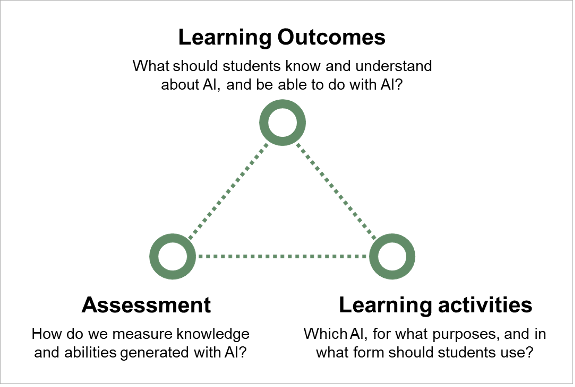

## 3.1 Integrating AI into the Constructive Alignment Approach

Constructive alignment is an effective technique to create pedagogically
sound courses. It means systematically aligning the core elements of
teaching - learning outcomes, learning activities, and assessment - with
one another. When integrating AI into a course, it is crucial to think
about the purpose of AI and how students can best utilize it to achieve
the intended learning outcomes.

Teachers are recommended to follow three key steps in course design:

> 1\. **Define the** **AI-related elements of learning outcomes** in
> terms of assessable knowledge, skills, and competencies. This is the
> basis for selecting course content.
>
> 2\. **Establish the** **criteria and methods for assessing** the
> achievement of AI-related learning outcomes.
>
> 3\. **Select appropriate AI tools and determine** how students will
> use them in exercises, assignments, presentations, examinations, and
> other activities.

<figure>

<figcaption>
Integrating AI into Constructive
Alignment
</figcaption>
</figure>

When applying the constructive alignment approach to course design, it
is helpful to distinguish between different kinds of AI-related learning
outcomes:

- AI knowledge and skills may be defined as direct learning outcomes,
    e.g. when students are expected to describe the components of AI
    systems, to explain how they are connected, or to develop an AI
    system.

    In this case, AI knowledge and skills are subject-specific, and the
    learning outcomes focus on professional, methodical, or analytical
    competencies.

<!-- -->

- Students might be advised to use AI as a tool that helps them
    achieve an overarching learning outcome, e.g. using a specific AI
    tool to summarize texts and to extract relevant content to produce
    an overview of the state of the art in a given subject.

    In the second case, a variety of AI tools can be used to help
    achieve a higher-order learning outcome. In relation to this
    learning outcome, the use of AI can be considered an important
    element of general AI literacy, and therefore a transversal
    competence.

This distinction is important because it influences both the emphasis
placed on each learning activity during assessment and the criteria used
to evaluate it.

## 3.2 Cultivating critical thinking

Critical thinking essentially means the ability to interpret, analyse,
and evaluate information, facts, and behaviour independently,
reflexively, and sceptically. This means being able to make a
'purposeful, self-regulatory judgment which results in interpretation,
analysis, evaluation, and inference, as well as explanation of the
evidential, conceptual, methodological, criteriological, or contextual
considerations upon which that judgment is based' (Facione 1990: 2).

AI tools generally generate incomplete and often incorrect, distorted,
or misleading outputs, the ability to critically scrutinize AI-generated
outputs is gaining particular importance. Therefore, teachers need to
advise and train students to critically assess AI outputs, verify facts,
and recognize biases, preparing them to discern accurate information.
See [Chapter '4.4 Teaching strategies to promote critical
thinking'](../04-designing-courses/#teaching-strategies-to-promote-critical-thinking) for
practical ideas to support students' critical thinking.

## 3.3 Fostering academic integrity 

With generative AI tools capable of generating text, images, sound, and
code, academic institutions need to re-emphasize the relevance of the
independent work of students, teachers, and researchers. This shift
necessitates the development of academic integrity policies focusing on
disclosing AI use, distinguishing between human and AI-generated content
through proper documentation, quotation, and acknowledgment of outputs
generated by AI as basic requirements.

A promising approach towards ensuring the transparent use of AI is to
require teachers, students, and researchers to document their use of AI
and to explain how, and to what extent, AI-assisted or AI-generated data
and output were used in preparing assignments, theses, or research
reports.

For handling academic integrity in the course, see [Chapter '4.7
Demanding academic integrity and good scientific
practice'](../04-designing-courses/#demanding-academic-integrity-and-good-scientific-practice).

